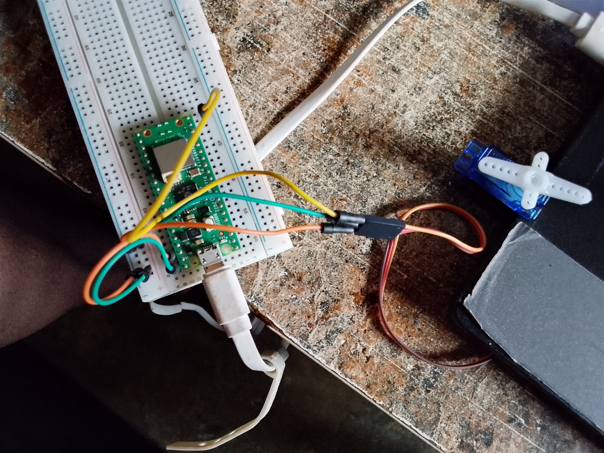

# Servo-Motor-Sweep-Control-Pico-W

## Description

This project demonstrates how to control a servo motor using PWM (Pulse Width Modulation) on a Raspberry Pi Pico W. The servo motor is connected to GPIO 15 and continuously sweeps through its range of motion by gradually increasing the PWM duty cycle.

## Components Used

- Raspberry Pi Pico W
- Servo Motor
- Jumper Wires
- USB Cable

## Wiring

| Servo Pin | Raspberry Pi Pico W |
|------------|--------------------|
| VCC | 5V (VBUS) |
| GND | GND |
| Signal | GP15 |

 

## Project Demo video

[Click here to download the project Demo video](https://youtu.be/wXvxytE5WUE) 

## Project Code file

[click Here to download the project file](code/servo_motor_angle_increament_project.py)


## Code

```python
import machine
from time import sleep as s

servopin = 15
servo = machine.PWM(machine.Pin(servopin))
servo.freq(50)
counter = 0

while True:
    counter = counter + 255
    servo.duty_u16(counter)

    if (counter > 8191):
        counter = 0

    s(0.1)
```

## How It Works

- A PWM signal is generated on GPIO 15.
- The PWM frequency is set to 50 Hz, which is suitable for most servo motors.
- The duty cycle value gradually increases.
- As the duty cycle changes, the servo motor moves through its range of motion.
- When the maximum value is reached, the duty cycle resets and the movement starts again.

## Output

The servo motor continuously rotates through different positions, creating a sweeping motion.

## Author

Moses Olorunfemi Kolawole
